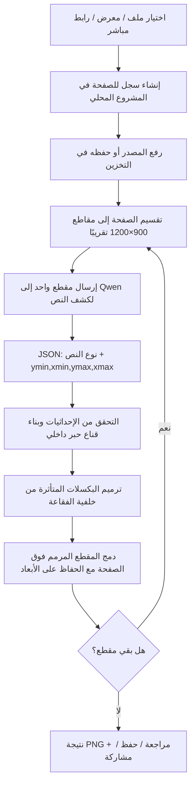

# كيف يعمل تبييض فقاعات المانهوا في التطبيق

## الخلاصة أولًا

التطبيق **لا يعيد توليد الصفحة كاملةً** في المسار الذي يستعمله الطابور حاليًا. بل يمر بمسارين منفصلين ومتكاملين: مسار **كشف** يحدد موضع النص داخل فقاعة الحوار، ومسار **ترميم بكسلي محلي** يزيل الحبر وطبقاته ويعيد بناء لون الخلفية من بكسلات محيطة.

> كشف النص يجيب عن سؤال: «أين يجب أن أعدّل؟». التبييض يجيب عن سؤال: «بأي لون أستبدل البكسلات الموجودة هناك؟».

لذلك فإن نجاح التبييض يعتمد بدرجة كبيرة على دقة موضع النص الذي يعود من الكاشف؛ لكنه لا يطلب من نموذج توليد الصور رسم صفحة جديدة أو تغيير الرسوم خارج منطقة النص.

---

## 1. المكونات الرئيسة

| المكوّن | المكان في المشروع | وظيفته |
|---|---|---|
| تطبيق الهاتف | `app/` و`contexts/batch-context.tsx` | اختيار الصور، تشغيل طابور الصفحات، عرض التقدم، المراجعة والتصدير. |
| واجهة الخلفية | `server/routers.ts` | تستقبل طلبات الاستيراد، حفظ المصدر، ومعالجة كل مقطع. |
| محرك التنظيف | `server/manga-bubble-cleaner.ts` | يحضّر المقطع، يطلب كشف النص، ينشئ القناع، ويرمم البكسلات. |
| موفر كشف النص | واجهة Qwen الخارجية المتوافقة مع OpenAI | يرى مقطع الصورة ويرد بإحداثيات النص فقط. |
| التخزين | `server/storage.ts` | يحفظ الأصل ونتائج المراحل كمفاتيح ملفات، ويعطي روابط تحميل مؤقتة للخادم. |
| مراجعة النتيجة | `app/review.tsx` | قارئ عمودي، مقارنة الأصل والنتيجة، وتصحيح يدوي وحفظ ومشاركة. |
| التخزين المحلي | `AsyncStorage` | يحتفظ بالمشروع النشط، مكتبة المشاريع، وسجل الدفعات وإعداد الجودة على الجهاز. |

---

## 2. تدفق المعالجة من الصورة إلى النتيجة



الصفحة الطويلة لا تُعالج في طلب واحد. يحسب التطبيق عدد المقاطع بصيغة `ceil(height / 1200)` ويعالجها **واحدًا بعد الآخر**، لا بالتوازي. السبب هو تقليل ضغط الذاكرة وعدم دمج نتائج متعددة في الوقت نفسه. بعد كل مقطع تُحفظ نتيجة وسيطة، ثم تصبح هي مصدر المقطع التالي؛ أي أن التعديل السابق لا يضيع عند الانتقال إلى الجزء التالي.

---

## 3. الاستيراد وحماية المصدر

هناك ثلاثة مسارات للإدخال: الملفات، معرض الهاتف، والرابط المباشر. الصور المحلية تُحوّل إلى `data URL` ثم تُحفظ عبر الخادم. أما الرابط المباشر فيُنزل من الخادم نفسه بعد تحقق أولي من البروتوكول والنوع والحجم.

محرك الرابط يقبل فقط `HTTP` أو `HTTPS` وصيغ `PNG` و`JPEG` و`WebP`، ويرفض عناوين الشبكة المحلية مثل `localhost` و`127.x.x.x` و`192.168.x.x`. كما يضع حدًا قدره **20 ميغابايت** للصورة الواحدة في مسار الخادم. هذا جزء حماية لمنع تحويل الاستيراد من رابط إلى وصول غير مقصود لخدمات داخلية.

بعد الحفظ، لا يحتفظ العميل بملف الصورة داخل حالة JavaScript فقط. يحتفظ بـ`sourceKey`، وهو مفتاح المصدر في التخزين، بالإضافة إلى الرابط والاسم والأبعاد والحالة. لهذا يمكن استئناف مشروع محلي عند فتح التطبيق، ما دامت مفاتيح الملفات ما تزال متاحة.

---

## 4. كشف النص: ما الذي يفعله Qwen تحديدًا؟

### الطلب المرسل

لكل مقطع، يحول الخادم بيانات PNG إلى `base64` ويرسلها إلى المسار:

```text
POST https://ggg-production-739f.up.railway.app/v1/chat/completions
```

الطلب يستعمل نموذج `qwen`، بدرجة عشوائية `temperature: 0`، وبحد استجابة `max_tokens: 1200`. مفتاح الموفر محفوظ على الخادم باسم `EXTERNAL_OPENAI_API_KEY` ويُرسل في ترويسة `Authorization: Bearer ...`؛ لا يُضمَّن في تطبيق الهاتف.

البرومبت يطلب صراحة ما يلي:

1. عدم اختيار شعار أو مؤثر صوتي أو حدود لوحة أو نص خارج فقاعة مغلقة.
2. اختيار نص الحوار أو صندوق التعليق فقط، حتى لو كانت الفقاعة سوداء أو حمراء أو شفافة أو متدرجة.
3. إعادة **صندوق ضيق حول الحبر**، يشمل التعبئة والحد والتوهج والظل، من دون إطار الفقاعة أو ذيلها أو فراغها الداخلي.
4. استخدام إحداثيات بكسلية حقيقة بالنسبة إلى المقطع المرسل، بالترتيب `[ymin, xmin, ymax, xmax]`.

شكل الرد المتوقع هو:

```json
{
  "coordinate_space": "pixels",
  "regions": [
    {
      "kind": "dialogue",
      "bbox_2d": [528, 328, 568, 572],
      "text": "اختياري"
    }
  ]
}
```

### كيف يُقرأ الرد؟

النموذج لا يلتزم دائمًا بـJSON خام؛ قد يضعه داخل شرح أو بين علامات Markdown مثل ```` ```json ````. لذلك لا يحاول الخادم تحليل النص كاملًا فقط. يبحث بالترتيب في النص الأصلي، وكتل Markdown، وأول كائن JSON ظاهر في الرد. ثم يتحقق من أن كل قيمة رقمية، ويقصها داخل حدود المقطع، ويرفض أي منطقة أضيق من 8×8 بكسل أو نوعها ليس `dialogue` أو `caption`.

بعد ذلك يدمج الصناديق المتداخلة بقوة، ويحتفظ بحد أقصى ست مناطق في المقطع. هذه ليست «خريطة حروف» من Qwen؛ هي **إحداثيات أولية دقيقة نسبيًا** توجه محرك القناع المحلي.

---

## 5. ما هو القناع؟ وما الفرق بينه وبين الإحداثيات؟

الإحداثيات التي يعيدها Qwen هي مستطيل: بداية ونهاية مكان النص. لكن المستطيل يحتوي عادةً على جزأين مختلفين:

| الجزء | هل يجب تغييره؟ | المثال |
|---|---:|---|
| حبر النص | نعم | تعبئة الحروف، الحد الأسود، التوهج الأبيض، الظل الأحمر. |
| الخلفية المحيطة داخل المستطيل | لا | اللون الوردي الفاتح بين الحروف، فراغ الفقاعة. |

القناع هو مصفوفة ثنائية داخل ذلك المستطيل: قيمة `1` تعني «عدّل هذا البكسل»، وقيمة `0` تعني «اتركه كما هو». التطبيق لا يتلقى حاليًا قناعًا جاهزًا على مستوى كل بكسل من Qwen. بل ينشئه محليًا بعد وصول الصندوق، وفق فرق اللون بين البكسل الحالي ولون الخلفية المتوقع في مكانه.

هذا التفريق مهم: لو مُلئ المستطيل كله بلون واحد فسيظهر الشريط أو الرقعة التي اشتكيت منها. ولو كان القناع أصغر من الظل أو الحد فستبقى بقايا الحروف. لذلك يعمل المحرك على تقدير الخلفية أولًا، ثم تعديل البكسلات المختلفة عنها فقط.

---

## 6. خوارزمية التبييض والترميم البكسلي

الوظيفة الأساسية اسمها `inpaintDetectedTextBoxes`. لا تستدعي Qwen ولا أي نموذج توليد صور. تعمل على مصفوفة RGBA خامة للمقطع الحالي.

### 6.1 التحقق من نوع خلفية الفقاعة

يفحص المحرك حلقة تبعد 20 بكسل حول صندوق النص. يقارن لون كل عينة بجارها أفقيًا وعموديًا. إذا كانت الفروق صغيرة في أغلب الحلقة، تُصنَّف الخلفية كـ**ناعمة**: مثل فقاعة ورقية بيضاء، أو تدرج وردي/أحمر هادئ.

هذه الحلقة بعيدة عن الحروف عمدًا؛ النسخ الأقدم كانت تفحص قرب النص جدًا، فكانت تقرأ ظل الحروف كأنه جزء من الخلفية وتختار مسارًا خاطئًا.

### 6.2 بناء لون الخلفية المتوقع

لكل نقطة داخل منطقة النص، يأخذ المحرك متوسط خمس بكسلات فوق بعضها عند الحافة اليسرى، ومتوسط خمس بكسلات عند الحافة اليمنى. ثم يستوفي لونًا بين الطرفين بحسب موقع النقطة أفقيًا.

> في الفقاعة ذات التدرج الناعم، اللون المتوقع ليس أبيض ثابتًا؛ بل لون يتغير من اليسار إلى اليمين. لهذا لا تُبيَّض الفقاعة الملونة إلى أبيض في هذا المسار.

في الخلفية غير الناعمة، يمزج كذلك تقديرًا من أعلى وأسفل المنطقة، لتقليل الأثر عند وجود تغيّر عمودي أو نسيج بسيط.

### 6.3 اختيار بكسلات الحبر

يقارن المحرك بين لون البكسل الأصلي ولون الخلفية المتوقع باستخدام مسافة لونية RGB. إذا تجاوز الفرق العتبة، يدخل البكسل في القناع:

| نوع الخلفية | حد الفرق | هامش حول صندوق Qwen | تمديد القناع |
|---|---:|---:|---:|
| ناعمة / متدرجة | 50 | من 14 إلى 22 بكسل | 5 تمريرات تمديد 3×3 |
| خشنة / ذات نسيج | 20 | 4 بكسلات | تمريرة تمديد واحدة |

تمديد القناع ضروري كي لا تبقى حافة مضادة للتعرج أو ظل ملاصق خارج جسم الحرف. لكنه يبقى مقيدًا بمناطق الحبر التي اختيرت أولًا، فلا يمس كل الفراغ بين الحروف.

### 6.4 الكتابة والحفاظ على الصورة

لكل بكسل يقع داخل القناع بعد التمديد، يستبدل RGB بلون الخلفية المتوقع، لكنه يحافظ على قيمة Alpha الأصلية. خارج القناع لا يكتب المحرك أي بكسل. بعد ذلك يعيد تكوين المقطع PNG ثم يركبه في موضعه نفسه فوق المصدر، لذلك يبقى **العرض والارتفاع والتركيب الهندسي** للصفحة كما هما.

---

## 7. ما الذي لا يفعله المسار الحالي؟

المسار الحالي لا يملك بعد قناعًا حقيقيًا على مستوى الحرف من نموذج رؤية متخصص، ولا يملك استنساخًا يدويًا مشابهًا لأداة Clone Stamp في Photoshop. لهذا توجد حدود واقعية لا ينبغي إخفاؤها:

| الحالة | الوضع الحالي | النتيجة المتوقعة |
|---|---|---|
| نص داكن/فاتح فوق تدرج فقاعة ناعم | جيد غالبًا إذا كان صندوق Qwen ضيقًا | ترميم قريب من الخلفية مع بقاء الإطار. |
| نص بحد وظل وتوهج | يحاول القناع الموسع تغطية الطبقات | يحتاج صندوقًا يشمل الطبقات كلها؛ قد تبقى نقطة دقيقة. |
| خلفية فقاعة مليئة بخطوط رسم أو نسيج معقد | لا يولّد تفاصيل جديدة | يمكن أن يترك أثرًا أو يتطلب مراجعة يدوية. |
| نص خارج فقاعة أو مؤثر صوتي | البرومبت يطلب تجاهله | ليس مضمونًا مئة بالمئة لأن قرار التصنيف من نموذج رؤية. |
| فقاعة ممتدة بين مقطعين | لا توجد حاليًا منطقة تداخل بين المقاطع | قد تحتاج مراجعة عند موضع القطع. |

هناك مسار قديم في الخادم باسم `cleanStoredMangaBubbleImage` يستخدم رقعًا توليدية. **الطابور الحالي لا يعتمد عليه**؛ الطابور يستدعي `cleanMangaTile` الذي يعتمد على Qwen للإحداثيات والترميم البكسلي المحلي. يجب إزالة أو تعطيل المسار القديم لاحقًا لمنع استعماله عرضًا، لأنه أثقل وأكثر عرضة لتغيير الرسم.

---

## 8. التصحيح اليدوي في شاشة المراجعة

بعد النتيجة تستطيع فتح قارئ الصفحة الطويلة، التبديل بين الأصل والنتيجة، ثم تفعيل زر القلم. عند الضغط في وسط نص متبقٍ، تنشئ الشاشة تحديدًا بنسبة من أبعاد الصورة، وترسله بوصفه `BubbleMaskAdjustment` من نوع `include`.

الإحداثيات اليدوية تحفظ كنسب بين 0 و1، لا كبكسلات ثابتة. عند معالجة مقطع معين يحوّلها الخادم إلى بكسلات الصفحة ثم يضيف فقط الجزء الذي يتقاطع مع ذلك المقطع. هذا يمنع تطبيق التصحيح نفسه على كل مقاطع الصفحة.

الواجهة الحالية تعطي **تحديدًا مستطيلاً ثابت الحجم نسبيًا**، وليست فرشاة رسم حرة. لذلك هي حل مراجعة سريع، وليست بديلًا كاملًا لقناع حرفي يدوي. الخطوة الصحيحة التالية هي فرشاة تشمل/تستثني البكسلات مع معاينة القناع قبل التنفيذ.

---

## 9. المشاريع والطابور والاستمرارية

كل صورة تحمل حالة واحدة من: `queued`، `detecting`، `cleaning`، `needs-review`، `completed` أو `failed`. الصور المتعددة تسير بالتتابع داخل `processBatch`؛ الصفحة التالية لا تبدأ حتى تنتهي السابقة أو تفشل.

يحفظ التطبيق المشروع النشط ومكتبة حتى 20 مشروعًا وسجلًا قصيرًا للدفعات داخل `AsyncStorage` على الجهاز. هذا يعني أن إغلاق التطبيق لا يمسح حالة المشروع المحلية عادةً. لكن هذا **ليس تعاونًا سحابيًا بين أعضاء الفريق**: لا توجد بعد حسابات، قاعدة بيانات لمهام الفريق، مزامنة تعليقات، أو قفل صفحة يمنع محررين من تعديل الصفحة نفسها.

---

## 10. المراجعة والتصدير

شاشة المراجعة تعرض الصفحة كقارئ مانهوا عمودي قابل للتمرير. زر المقارنة يعيد موضع القراءة إلى الأعلى عند الانتقال بين الأصل والنتيجة. الحفظ والمشاركة لا يعالجان الصورة ثانيةً؛ بل ينزّلان نتيجة PNG الجاهزة إلى مجلد cache محلي، ثم:

| الإجراء | التنفيذ |
|---|---|
| مشاركة | يستخدم ورقة المشاركة الأصلية في الهاتف. |
| حفظ بالجهاز | يطلب إذن مكتبة الصور ثم يحفظ PNG فيها. |
| الويب | يفتح رابط النتيجة في نافذة جديدة. |

الأصل لا يُستبدل: تبقى النسخة الأصلية محفوظة بمفتاح مستقل، والنتيجة لها مفتاح مختلف.

---

## 11. الأداء والاعتمادات الخارجية

التبييض المحلي نفسه يعتمد على معالجة بكسلات و`Sharp` في الخادم. أما كشف النص وحده فيرسل كل مقطع إلى Qwen. لذلك إذا لم يتوفر مفتاح الموفر أو تأخر الرد أو وصل إلى مهلة 180 ثانية، تفشل الصفحة عند **مرحلة الكشف** قبل الوصول إلى الترميم.

معالجة صفحة ارتفاعها 16000 بكسل تعني حاليًا نحو 14 مقطعًا بارتفاع 1200 بكسل. هذه الدقة في التقسيم تحسن فهم الإحداثيات، لكنها تزيد عدد طلبات الكشف. كذلك، التنفيذ الحالي ينزّل ويعيد ترميز الصفحة الكاملة عند كل مقطع لكي يحفظ النتيجة الوسيطة؛ هذا يحافظ على الاستئناف، لكنه ليس التصميم الأعلى كفاءة للصفحات الطويلة جدًا.

الصور لا تُرسل إلى Qwen كاملة دفعة واحدة، بل مقطعًا بعد مقطع. ومع ذلك، أي مقطع يجري كشفه يُرسل إلى الموفر الخارجي؛ إن كانت خصوصية الصفحات شرطًا حاسمًا، يجب استعمال موفر خاص/محلي مصرح به أو كاشف يعمل داخل بنية مملوكة للفريق.

---

## 12. علاقة خطأ 502 الذي ظهر في Expo Go بالتبييض

الخطأ المعروض على الهاتف كان صفحة HTML من وسيط الوصول تقول `HTTP response error 502`. هذا يعني أن Expo Go لم يستطع الوصول إلى خادم التطوير عبر الرابط في تلك اللحظة؛ إنه **فشل اتصال أو خدمة تطوير**، وليس نتيجة صورة تالفة أو فشل خوارزمية القناع نفسها.

عندما يفشل Qwen داخل تطبيق مفتوح، المسار المعتاد في التطبيق يلتقط الخطأ ويحوّل حالة الصفحة إلى `failed` مع رسالة على البطاقة. أما خطأ 502 قبل فتح التطبيق فيشير إلى أن حزمة JavaScript لم تصل إلى الهاتف أصلًا. لم أعد أفحص سجل ذلك الحدث بعد طلبك إيقافه، لذلك لا أدعي سببًا دقيقًا مثل ضغط الذاكرة أو توقف العملية؛ لكن لا توجد علاقة مباشرة بين 502 وشكل التبييض.

---

## 13. ما الذي يلزم للوصول إلى جودة تسليم احترافية؟

الحل الحالي مناسب كأساس عملي: كاشف رؤية يعيد صناديق ضيقة، وترميم محلي لا يرسم الصفحة من جديد، ومراجعة يدوية للحالات الصعبة. أما للوصول إلى نتيجة «لا يمكن تمييزها» عبر كل أنواع المانهوا، فالمسار التالي هو الأكثر فاعلية:

1. جعل Qwen يعيد `polygon` أو قناعًا مضغوطًا لكل طبقة نص بدل صندوق فقط.
2. إضافة فرشاة قناع تشمل/تستثني البكسلات مع تكبير الصورة ومعاينة قبل/بعد.
3. إضافة درجة ثقة للكشف؛ الصندوق المنخفض الثقة ينتقل إلى `needs-review` بدل أن يعدّل الرسم تلقائيًا.
4. تشغيل worker مخصص للصفحات الطويلة يحفظ مقاطع منفصلة ثم يدمجها في النهاية، بدل إعادة ترميز الصفحة كاملةً مع كل مقطع.
5. بناء مزامنة فريق حقيقية إذا كان المطلوب مشاركة العمل بين أجهزة متعددة: حسابات، مشاريع، صفحات، مراجعات وتعليقات وصلاحيات.

## خلاصة نهائية

التبييض الحالي ليس زرًا يطلب من نموذج ذكاء اصطناعي إعادة رسم الصفحة. هو خط معالجة مكوّن من **كشف موضع النص → قناع بكسلي داخلي → تقدير خلفية محلي → استبدال البكسلات المقنّعة → دمج وحفظ**. القوة فيه أنه يحافظ على الرسم خارج المنطقة المستهدفة؛ والنقطة التي تحتاج تحسينًا دائمًا هي مدى دقة القناع في فصل الحبر والظل والتوهج عن الخلفية، خصوصًا في الفقاعات ذات النسيج أو الرسم المعقد.
